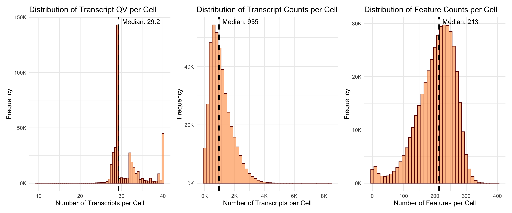
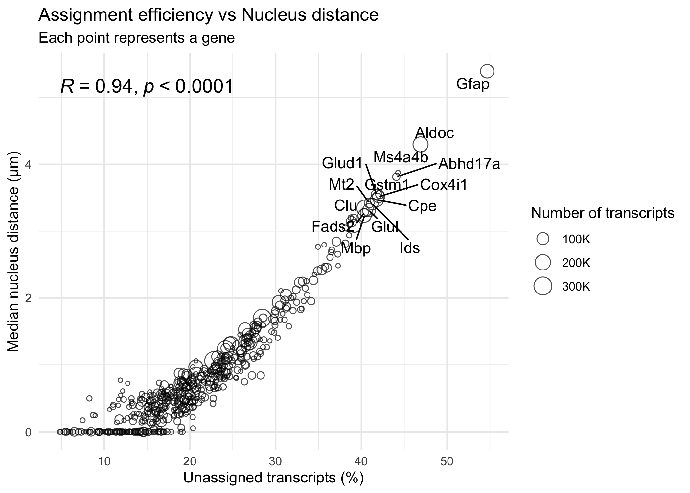

# Summary of segmentation metrics across expansion conditions

We compared segmentation performance across five nuclear expansion
distances: 0, 3, 5, 10, and 20 micrometers. We recursively located all
`metrics_summary.csv` files within the Slide1_resegmented_XeniumRanger
directory. We read each file and extracted the expansion condition from
the directory name. We combined the metrics into a single data frame for
comparative analysis.

|  | 0 | 3 | 5 | 10 | 20 |
|:---|---:|---:|---:|---:|---:|
| total_cell_area | 16441851.816 | 44929486.065 | 63380049.477 | 104962443\.583 | 135137212\.028 |
| total_high_quality_decoded_transcripts | 493722366\.000 | 493722366\.000 | 493722366\.000 | 493722366\.000 | 493722366\.000 |
| nuclear_transcripts_per_100um2 | 1032.974 | 1032.974 | 1035.167 | 1032.974 | 1032.974 |
| decoded_transcripts_per_100um2 | 1032.974 | 689.073 | 565.019 | 420.485 | 359.913 |
| adjusted_negative_control_probe_rate | 0.003 | 0.003 | 0.003 | 0.003 | 0.003 |
| adjusted_negative_control_codeword_rate | 0.001 | 0.001 | 0.001 | 0.001 | 0.001 |
| negative_control_probe_counts_per_control_per_cell | 0.002 | 0.003 | 0.004 | 0.006 | 0.007 |
| estimated_number_of_false_positive_transcripts_per_cell | 0.775 | 1.667 | 2.021 | 2.921 | 3.487 |
| num_cells_detected | 400914.000 | 400914.000 | 413608.000 | 400914.000 | 400914.000 |
| fraction_empty_cells | 0.005 | 0.002 | 0.002 | 0.001 | 0.001 |
| cells_per_100um2 | 0.215 | 0.215 | 0.222 | 0.215 | 0.215 |
| fraction_transcripts_assigned | 0.344 | 0.627 | 0.725 | 0.894 | 0.985 |
| median_genes_per_cell | 134.000 | 181.000 | 190.000 | 210.000 | 217.000 |
| median_predesigned_genes_per_cell | NA | NA | NA | NA | NA |
| median_custom_genes_per_cell | NA | NA | NA | NA | NA |
| median_transcripts_per_cell | 365.000 | 681.000 | 769.000 | 986.000 | 1068.000 |
| segmented_cell_nuc_expansion_count | 400914.000 | 400914.000 | 413608.000 | 400914.000 | 400914.000 |

metrics per expansion condition

We generated a summary table displaying key metrics across all expansion
conditions. Cell boundary expansion had a profound effect on transcript
assignment. The fraction of transcripts assigned to cells increased from
0.344 at 0 micrometer expansion to 0.985 at 20 micrometer expansion.
This represents a 2.9-fold improvement in transcript capture efficiency.
Median transcripts per cell increased progressively from 365 at 0
micrometers to 1,068 at 20 micrometers. Similarly, median genes per cell
rose from 134 to 217 across the same range. Total cell area expanded
dramatically from 16.4 million square micrometers at 0 micrometers to
135.1 million at 20 micrometers. The number of detected cells remained
stable at approximately 401,000 across most conditions, with the 5
micrometer expansion detecting 413,608 cells. These results demonstrate
that nuclear expansion substantially improves transcript recovery
without altering cell counts.

# Default 5um data

We focused on the default 5 micrometer expansion condition for detailed
analysis. We read the transcripts parquet file using DuckDB for
efficient processing. We excluded unassigned transcripts to focus on
cellular transcript content. We calculated three metrics per cell: total
transcript count, number of unique genes detected, and median transcript
quality value. We collected the results into a data frame for downstream
visualization.

## Summary statistics.

### Distribution of transcript metrics **per cell** (excluding unassigned transcripts)

We defined a histogram decoration function to add median lines and
labels to plots. We created three histograms to visualize the
distribution of transcript metrics across cells. The median transcript
quality value was 29.2, indicating high decoding confidence for most
transcripts. The median transcript count per cell was 955, demonstrating
substantial transcript capture in the 5 micrometer expansion condition.
The median feature count was 213 genes per cell. These distributions
reveal the typical cellular content captured by the default expansion
strategy. All three metrics showed right-skewed distributions, with some
cells containing considerably more transcripts and genes than the
median.

## Relationship between assignment efficiency and nucleus distance **per gene**

Subsample 10 million transcripts to speed up computation.

We subsampled 10 million transcripts from the full dataset to enable
rapid computation. We used DBI with DuckDB to execute a SQL query with
random ordering and row limiting. This approach bypassed limitations in
duckplyr’s sampling capabilities. The subsampled dataset provided
sufficient statistical power for gene-level analysis while reducing
computational burden.

We calculated gene-level assignment metrics from the subsampled
transcripts. We excluded negative control probes to focus on biological
genes. We grouped transcripts by gene and computed total transcript
count, number of cells containing the gene, median quality value,
unassigned percentage, and median nucleus distance. We arranged genes by
decreasing transcript abundance. We flagged genes with more than 40%
unassigned transcripts for labeling in visualizations. This analysis
revealed gene-specific patterns in spatial distribution and assignment
efficiency.

We generated a scatter plot relating unassigned transcript percentage to
median nucleus distance for each gene. Each point represents a single
gene, sized by total transcript count. We observed a strong positive
correlation between nucleus distance and unassignment rate (R = 0.93, p
\< 0.0001). Genes with transcripts located farther from nuclei showed
systematically higher failure rates in cellular assignment. GFAP
exhibited the most extreme spatial pattern, with over 40% of its
transcripts unassigned and a median nucleus distance exceeding 5
micrometers. ALDOC, MT2, and ABHD17A similarly displayed high
unassignment rates coupled with large nucleus distances. These genes
likely encode proteins with extensive cytoplasmic functions or exhibit
long-range mRNA transport mechanisms. Conversely, genes with transcripts
concentrated near nuclei showed minimal unassignment. This gene-specific
spatial heterogeneity directly affects which transcripts are recovered
by expansion-based segmentation strategies and must be considered when
interpreting cell type assignments and differential expression results
from Xenium data.
