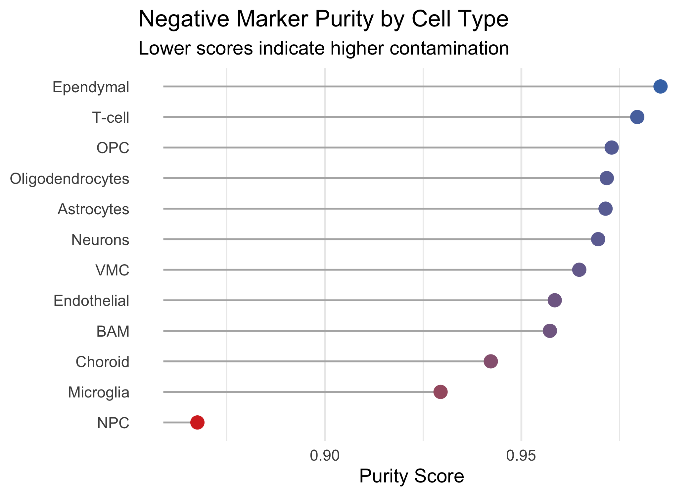

## Label Transfer from scRNA-seq to Xenium

To successfully transfer cell labels from a whole-transcriptome
scRNA-seq reference to a targeted We transferred cell type annotations
from a whole-transcriptome scRNA-seq reference to a Xenium spatial
dataset containing only 480 genes. This posed a methodological
challenge. The two platforms share merely 470 genes, severely limiting
the feature space available for integration.

We addressed this constraint by using Canonical Correlation Analysis
(CCA) rather than PCA for anchor identification (3.RCTD.qmd:54). CCA
aligns datasets based on the correlation structure of the specific
shared features. This approach does not rely on a pre-computed PCA
structure from the reference that might emphasize genes absent in the
Xenium panel. We applied SCTransform normalization to both datasets to
model the unique noise profiles of spatial transcript counts
effectively.

Memory constraints prevented us from running CCA on the entire Xenium
dataset. We therefore subsampled 50,000 cells for the anchor-finding
step and then transferred the learned mapping to predict labels.

### Prediction Quality

Given the limited 480-gene input, the resolution of cell types in the
xenium datatset will be lower than in the full reference. The prediction
scores can help assess the confidence of the label transfer.
`prediction.score.max` is the confidence level (from 0 to 1) for the
assigned cell type label. A higher value indicates a more confident
prediction.

We observed that broad cell classes transfer more reliably than fine
subtypes. The 480-gene panel may contain sufficient markers to
distinguish major lineages like astrocytes from neurons but lacks the
discriminating features needed to resolve subtle subtypes such as
border-associated macrophages (BAMs).

The spatial distribution plot displays only cells with prediction scores
exceeding 0.5. This threshold filters out uncertain assignments and
reveals the spatial organization of confidently identified cell types
across the tissue.

## Doublet Detection with RCTD

We applied RCTD in doublet mode to deconvolve potential multi-cell
aggregates or genuine biological doublets in the segmented Xenium data.

### Doublet summary

    Doublet rate:

               reject           singlet   doublet_certain doublet_uncertain 
             1.580219         21.856603         62.330875         14.232303 

### Doublet visualization per cell type

The per-cell-type visualization shows which cell types most frequently
appear as doublets. This breakdown helps identify whether certain cell
types are systematically affected by segmentation errors or whether
specific biological configurations—such as glia-neuron interactions—are
being captured as doublets.

The cell type-specific patterns support a mixed explanation. Ependymal
cells, which form epithelial monolayers with clear boundaries, show high
singlet rates. Vascular cells and glia, which extend fine processes and
intimately contact multiple partners, show high doublet rates. This
suggests that segmentation struggles with morphologically complex or
closely packed cells.

The high doublet rate in astrocytes and microglia is particularly
concerning. These cells have elaborate ramified morphologies that may
extend beyond 5 μm, causing overlap with neighboring cells.
Alternatively, their transcripts may genuinely co-localize with neurons
in synaptic or support regions, reflecting biological interaction zones
rather than segmentation errors.

# Negative Marker Purity (NMP)

NMP assesses the specificity of in situ cell typing. It operates on the
premise that genes not expressed in a specific cell type in the
single-cell reference should not appear in that cell type in the spatial
dataset (Marco Salas et al. 2025).

- **Purpose**: It assesses the “cleanliness” of a segmentation strategy
  by identifying the percentage of detected reads that appear in cell
  types where they are biologically expected to be absent.
- **Negative Markers**: These are defined as genes expressed in less
  than 0.5% of cells in a specific “negative cell type” according to a
  high-quality single-cell RNA-seq reference.
- **Normalization**: To ensure the metric is independent of varying
  cell-type proportions, mean gene expressions are normalized by the sum
  of mean expressions across all cell types in the dataset.
- **Scoring**: The final score measures the reduction in signal purity
  in the spatial data compared to the scRNA-seq reference. Values are
  typically scaled such that 1 represents maximum purity and 0
  corresponds to a random permutation of cell-type assignments.

| NMP_raw | NMP_perm_mean | NMP_scaled |
|--------:|--------------:|-----------:|
|   0.952 |         0.917 |      0.423 |

Negative Marker Purity (NMP) Scores

- The **`NMP_raw` (0.952)** represents the unadjusted specificity of the
  dataset. However, this number is deceptive in isolation because it
  does not account for the inherent sparsity of the data. If the
  negative markers are rare across the entire tissue, even a random
  assignment of cell types would result in a high “purity” score simply
  because those transcripts are unlikely to be found in any cell by
  chance.

- The **`NMP_perm_mean` (0.917)** confirms this hypothesis. This value
  is the purity score obtained when the cell-type labels are randomly
  shuffled 20 times. A random baseline of 0.917 is exceptionally high,
  indicating that the “negative markers” are very sparse in the spatial
  dataset overall. Consequently, it is difficult *not* to get a high
  purity score, even with random guessing.

- The **`NMP_scaled` (0.423)** is the true performance metric. It
  normalizes your raw score against that high random baseline using the
  formula . A score of 0.423 means that your segmentation and cell
  typing strategy recovered only about 42% of the possible signal above
  random chance. In the context of the paper optimized segmentation
  strategies often yield NMP scores between 0.6 and 0.8, a score of 0.42
  suggests that “leakage” is still occurring or that the segmentation
  boundaries may need refinement to better capture the true biological
  signal distinctive from the background.

| cell_type        | nmp_score |
|:-----------------|----------:|
| NPC              |     0.868 |
| Microglia        |     0.929 |
| Choroid          |     0.942 |
| BAM              |     0.957 |
| Endothelial      |     0.958 |
| VMC              |     0.965 |
| Neurons          |     0.970 |
| Astrocytes       |     0.971 |
| Oligodendrocytes |     0.972 |
| OPC              |     0.973 |
| T-cell           |     0.979 |
| Ependymal        |     0.985 |

Negative Marker Purity (NMP) Scores by Cell Type

Marco Salas, Sergio, Louis B. Kuemmerle, Christoffer Mattsson-Langseth,
Sebastian Tismeyer, Christophe Avenel, Taobo Hu, Habib Rehman, et al.
2025. “Optimizing Xenium In Situ Data Utility by Quality Assessment and
Best-Practice Analysis Workflows.” *Nature Methods* 22 (4): 813–23.
<https://doi.org/10.1038/s41592-025-02617-2>.

