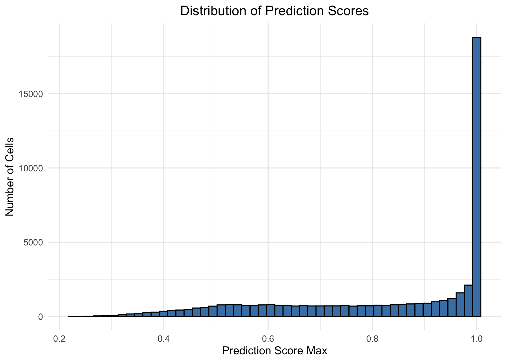
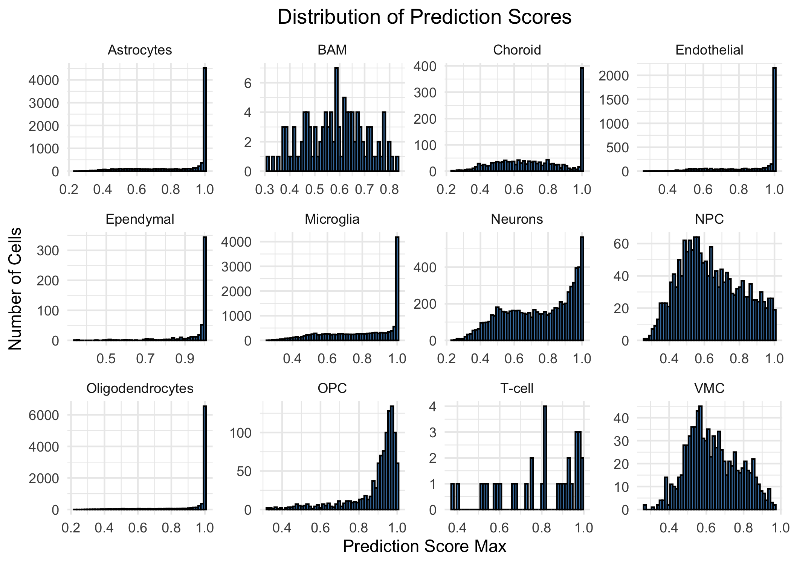
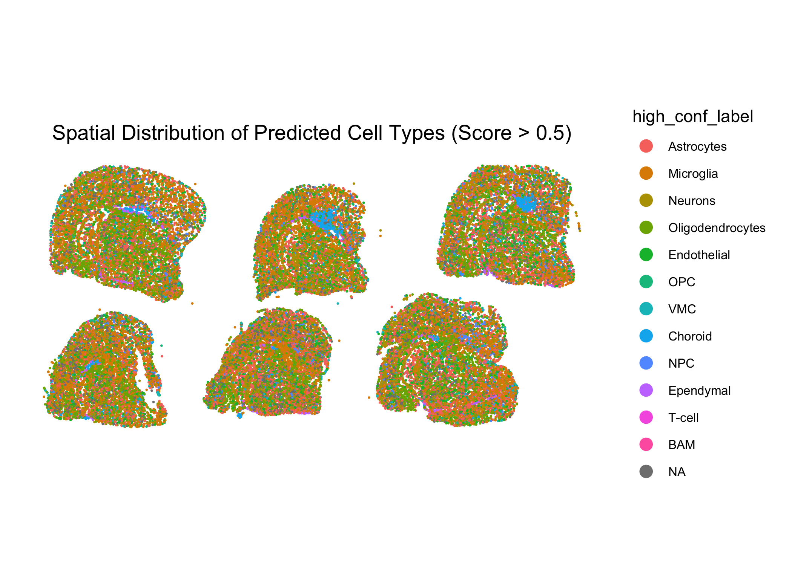
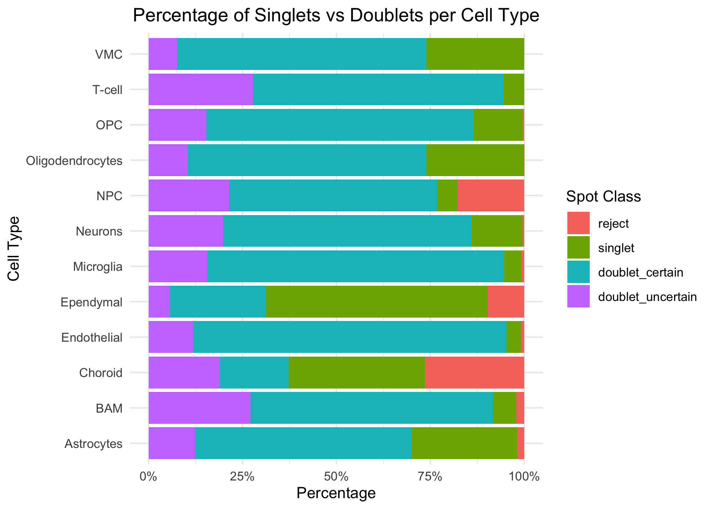

## Label Transfer from scRNA-seq to Xenium

To successfully transfer cell labels from a whole-transcriptome
scRNA-seq reference to a targeted We transferred cell type annotations
from a whole-transcriptome scRNA-seq reference to a Xenium spatial
dataset containing only 480 genes. This posed a methodological
challenge. The two platforms share merely 470 genes, severely limiting
the feature space available for integration.

We addressed this constraint by using Canonical Correlation Analysis
(CCA) rather than PCA for anchor identification (3.RCTD.qmd:54). CCA
aligns datasets based on the correlation structure of the specific
shared features. This approach does not rely on a pre-computed PCA
structure from the reference that might emphasize genes absent in the
Xenium panel. We applied SCTransform normalization to both datasets to
model the unique noise profiles of spatial transcript counts
effectively.

Memory constraints prevented us from running CCA on the entire Xenium
dataset. We therefore subsampled 50,000 cells for the anchor-finding
step and then transferred the learned mapping to predict labels.

### Prediction Quality

Given the limited 480-gene input, the resolution of cell types in the
xenium datatset will be lower than in the full reference. The prediction
scores can help assess the confidence of the label transfer.
`prediction.score.max` is the confidence level (from 0 to 1) for the
assigned cell type label. A higher value indicates a more confident
prediction.

We observed that broad cell classes transfer more reliably than fine
subtypes. The 480-gene panel may contain sufficient markers to
distinguish major lineages like astrocytes from neurons but lacks the
discriminating features needed to resolve subtle subtypes such as
border-associated macrophages (BAMs).

The spatial distribution plot displays only cells with prediction scores
exceeding 0.5. This threshold filters out uncertain assignments and
reveals the spatial organization of confidently identified cell types
across the tissue.

## Doublet Detection with RCTD

We applied RCTD in doublet mode to deconvolve potential multi-cell
aggregates or genuine biological doublets in the segmented Xenium data.

## Doublet summary

    Doublet rate:

               reject           singlet   doublet_certain doublet_uncertain 
             1.580219         21.856603         62.330875         14.232303 

## Doublet visualization per cell type

The per-cell-type visualization shows which cell types most frequently
appear as doublets. This breakdown helps identify whether certain cell
types are systematically affected by segmentation errors or whether
specific biological configurations—such as glia-neuron interactions—are
being captured as doublets.

The cell type-specific patterns support a mixed explanation. Ependymal
cells, which form epithelial monolayers with clear boundaries, show high
singlet rates. Vascular cells and glia, which extend fine processes and
intimately contact multiple partners, show high doublet rates. This
suggests that segmentation struggles with morphologically complex or
closely packed cells.

The high doublet rate in astrocytes and microglia is particularly
concerning. These cells have elaborate ramified morphologies that may
extend beyond 5 μm, causing overlap with neighboring cells.
Alternatively, their transcripts may genuinely co-localize with neurons
in synaptic or support regions, reflecting biological interaction zones
rather than segmentation errors.
